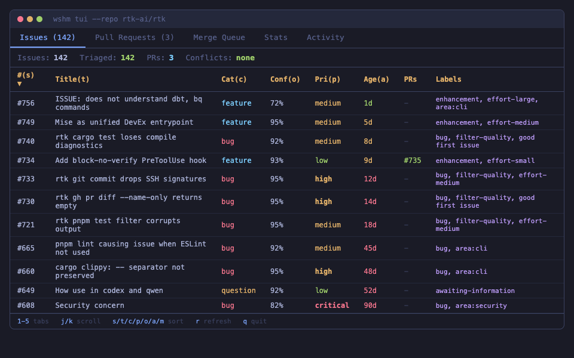
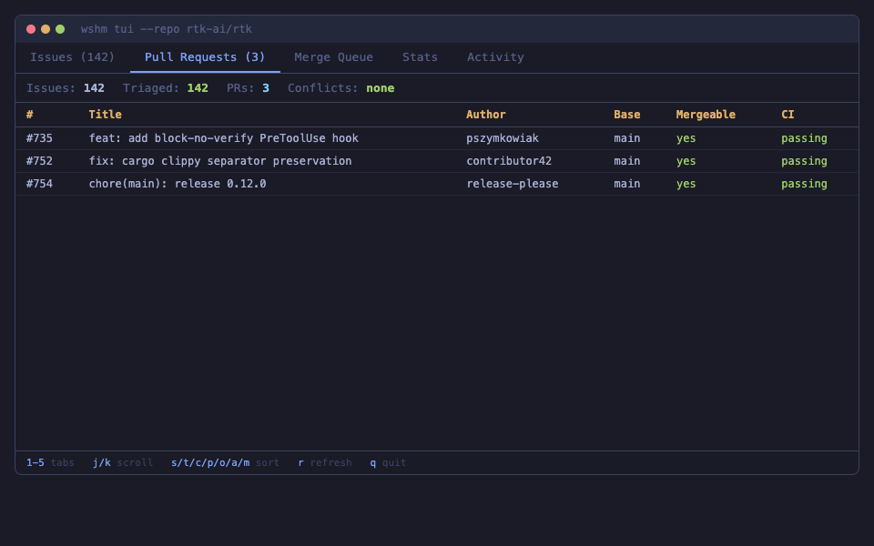
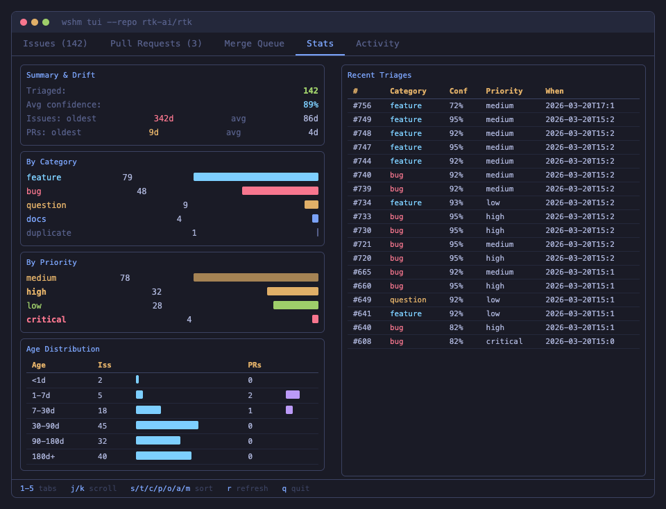

<div align="center">


# wshm

### Your repo's wish is my command.

**Five tools in one binary.** Replace CodeRabbit, Graphite, Sweep AI, Mergify, and manual triage with a single self-hosted Rust binary.

Works with GitHub, GitLab, Gitea, and Azure DevOps. Plug in Claude Max, OpenAI, or a local Ollama — your call. Your AI keys. Your data. No SaaS dependency.

**Runs on Linux (x86_64 & ARM64) and Windows (x86_64).**

[](LICENSE)
[](https://www.rust-lang.org/)


</div>

---

<p align="center">
  
</p>

## Why wshm?

You shipped the code. Now you spend your Mondays triaging a hundred stale issues, hunting duplicate bug reports, babysitting the merge queue, and writing the same "thanks for the report, can you share a reproduction?" reply for the tenth time.

wshm does the boring parts so you can stay in flow.

### Replace five tools with one

| Need                  | Typical tool  | Typical price     | wshm              |
|-----------------------|---------------|-------------------|-------------------|
| AI code review        | CodeRabbit    | $24 / dev / mo    | included          |
| Merge queue           | Graphite      | $40 / user / mo   | included          |
| Issue auto-fix        | Sweep AI      | $120–240 / mo     | included (Pro)    |
| Workflow automation   | Mergify       | $15–30 / user / mo| included          |
| Issue triage          | Manual        | Engineer hours    | automated         |

A 5-dev team pays **$870+/mo** for equivalent coverage across those tools. wshm is one binary, self-hosted, your AI keys.

### Pain → gain

| Pain | wshm |
|------|------|
| Stale backlog, no one labels issues | **AI triage** classifies + labels new issues in seconds, with confidence scores |
| "Is this PR safe to merge?" review paralysis | **PR risk analysis** surfaces low/medium/high risk + a review checklist |
| Merge queue is a shared Notion doc | **Scored merge queue** auto-promotes green PRs above your threshold |
| Duplicates and zombie PRs pile up | **PR health** flags duplicates, stale, and zombie PRs automatically |
| Secrets leak into `.env` and config | **Key vault** integration (Vault, AWS, **Azure Key Vault**, GCP) |
| SaaS tools hold your data hostage | **Self-hosted**, single Rust binary, SQLite or Postgres — your data stays yours |
| OpenAI subscription fatigue | **Claude Max / Pro / Team** OAuth login — reuse your existing plan |

## See it in action

```text
$ wshm triage --apply
Syncing issues... 247 issues loaded
Classifying with claude-sonnet-4-6 (OAuth: Claude Max)...

  #412  "App crashes on M1 when opening settings"
        → type: bug, priority: high, confidence: 0.94
        → labels applied: bug, platform:macos, priority:high

  #413  "Would love dark mode support"
        → type: feature, priority: medium, confidence: 0.87
        → labels applied: enhancement, ui

  #414  "how do i install this???"
        → type: question, priority: low, confidence: 0.91
        → labels applied: question, needs-docs
        → auto-reply posted: link to docs/getting-started.md

Triage complete: 23 issues labeled, 4 auto-replied, 1 flagged as duplicate of #398
```

Merge queue view (TUI):

```text
$ wshm queue
Rank  PR    Title                             Risk   Score  CI   Reviews  Action
 1    #891  fix: race in token refresh        low    94     OK   2/2      AUTO-MERGE
 2    #885  feat: add --json flag to queue    low    88     OK   2/2      READY
 3    #879  refactor: split notify module     med    71     OK   1/2      WAIT
 4    #902  chore: bump tokio                 low    66     OK   0/2      WAIT
 5    #876  feat: webhook retries             high   42     FAIL 0/2      BLOCKED
```

## Try it in 30 seconds

```bash
# Homebrew (macOS / Linux)
brew tap wshm-dev/tap && brew install wshm
# …or one-shot install with SHA256 verification (Linux x86_64/aarch64, Windows via Git Bash)
curl -fsSL https://raw.githubusercontent.com/wshm-dev/wshm/main/install.sh | sh

cd your-repo
wshm config init
export GITHUB_TOKEN=ghp_xxxxx
wshm login              # pick Claude Max, API key, or any supported provider
wshm sync
wshm triage             # dry-run — no --apply yet, just see what it would do
```

---

## Bring your own AI

wshm never ships an AI provider you have to pay extra for. Use whatever you already have.

- **Claude Max / Pro / Team** — OAuth login via the `claude` CLI, no API key, no separate billing
- **Any API provider** — Anthropic, OpenAI, Google, Mistral, Groq, DeepSeek, xAI, OpenRouter, Azure, Together, Fireworks, Cohere, Perplexity
- **Local models** — Ollama or llama.cpp, zero cost, zero data leaves your machine

```text
  Anthropic   OpenAI   Google   Mistral   Groq    DeepSeek   xAI
  OpenRouter  Ollama   Azure    Together  Fireworks Cohere   Perplexity
```

## Deploy anywhere

One static binary. No SaaS dependency. Runs where your code lives.

| Platform       | How                                                              |
|----------------|------------------------------------------------------------------|
| **VM / VPS**   | systemd service, auto-update via Homebrew, any Linux             |
| **Docker**     | `docker run innovtech/wshm:latest` — multi-arch (amd64 + arm64)  |
| **Kubernetes** | Helm chart, Kustomize overlays, or raw `Job`/`CronJob` manifests under [`deploy/`](./deploy) |
| **Local dev**  | `wshm tui` / `wshm triage` — works offline with Ollama           |

A GitHub Action is planned — follow [#22](https://github.com/wshm-dev/wshm/issues/22).

Forge support: **GitHub** (personal + org), **GitLab** (.com + self-managed), **Gitea / Forgejo / Codeberg**, **Azure DevOps** (Services + Server).

---

## Origin story

wshm was born out of a real need: triaging the growing backlog of issues and pull requests on [**rtk-ai/rtk**](https://github.com/rtk-ai/rtk) (Rust Token Killer). What started as a weekend script to auto-classify GitHub issues grew into a full repo agent — the tool we wished existed, now battle-tested on rtk itself before shipping to other repos.

---

## Features

### Free (this repo)

- **Issue triage** — AI classification (bug/feature/question/etc.), priority, confidence scoring, auto-labeling
- **PR analysis** — risk level (low/medium/high), type (feature/fix/docs), summary, review checklist
- **Merge queue** — scoring, auto-merge above threshold, conflict detection
- **PR health** — duplicate detection, stale/zombie PR flagging
- **Sync** — full / incremental fetch of issues and PRs from your forge
- **Run** — one-command cycle: sync + triage + analyze + queue
- **Backup / Restore** — snapshot your `.wshm/` data for safe migration
- **Revert** — undo all wshm actions (remove comments, labels, clear analyses)
- **Webhook notifications** — generic HTTP webhooks with HMAC signing
- **TUI** — rich interactive terminal UI (issues, PRs, queue, stats)
- **Context export** — dump repo context as LLM-ready markdown
- **Migrate** — move data between SQLite and PostgreSQL
- **14 AI providers** — Anthropic, OpenAI, Google, Mistral, Groq, DeepSeek, xAI, Ollama (local), llama.cpp, and more
- **Claude Max / Pro / Team subscription** — OAuth login via your existing Claude plan (no separate API key billing needed)
- **4 Git providers** — GitHub, GitLab, Gitea, Azure DevOps (self-hosted friendly)
- **Storage** — **SQLite** by default (zero setup, bundled), or **PostgreSQL** as an alternative primary backend
- **OIDC SSO** — login via Google, GitHub, GitLab, Azure AD

### Pro ([wshm.dev/pro](https://wshm.dev/pro))

Persistent automation, token-heavy AI features, and enterprise integrations:

- **Daemon** — persistent multi-repo background service with webhook server and embedded Svelte web dashboard
- **Rich notifications** — Discord, Slack, Teams (in addition to the Free webhook sink)
- **Changelog** — AI-generated changelog from merged PRs (markdown, JSON)
- **Dashboard** — HTML metrics dashboard with Chart.js graphs
- **HTML/PDF reports** — full repo health reports with SLA metrics
- **Inline code review** — line-by-line AI review on PR diffs
- **Auto-fix** — generate PRs from issue descriptions (Claude Code / Codex / containerized)
- **AI conflict resolution** — automatic rebase with AI assistance
- **Improvement proposals** — analyze codebase, create refactor/testing/perf issues
- **Cloud exports** — ship issues/PRs/analyses to external sinks:
  - Object storage: **S3**, **Azure Blob**, **GCS**
  - Databases: **PostgreSQL**, **MySQL**, **MongoDB**, **Elasticsearch**, **OpenSearch**
  - (distinct from the primary SQLite/PostgreSQL backend above — these are *additional* destinations)
- **Secret management / Key vaults** — HashiCorp Vault, AWS Secrets Manager, **Azure Key Vault**, GCP Secret Manager (keep license keys, webhook secrets, DB URIs, API keys out of config)
- **SAML SSO** — Okta, Azure AD, custom IdP
- **RBAC + Audit log** — organizations, roles, action audit trail

---

## Interfaces

wshm ships three interfaces out of the box (Free) plus a persistent daemon + web dashboard (Pro).

### CLI (Free)

```bash
wshm sync               # fetch issues + PRs
wshm triage --apply     # classify and label open issues
wshm pr analyze --apply # analyze and label open PRs
wshm queue              # show ranked merge queue
wshm run --apply        # full cycle
```

### TUI (Free)

Rich interactive terminal UI — browse issues, PRs, merge queue, and stats without leaving the terminal.

```bash
wshm tui
```

<p align="center">
  
  
  
</p>

### Daemon + Web dashboard (Pro)

The daemon is a long-running multi-repo service: webhook server, scheduled triage, rich notifications (Discord/Slack/Teams), and an embedded Svelte web dashboard served on `https://127.0.0.1:3000`.

```bash
wshm daemon --config /etc/wshm/global.toml --poll
```

<p align="center">
  
</p>

<p align="center">
  
  
</p>

<p align="center">
  
</p>

---

## Quick Start

### Install

#### Linux / macOS — Homebrew

```bash
brew tap wshm-dev/tap
brew install wshm
```

The Homebrew formula currently ships Linux bottles only (x86_64 + arm64); macOS users should use `cargo install wshm-core` until darwin builds are added.

#### Linux — install script (SHA256-verified)

```bash
curl -fsSL https://raw.githubusercontent.com/wshm-dev/wshm/main/install.sh | sh
```

Re-run to upgrade. Pin a version with `sh -s -- --version v0.28.2`. Every download is verified against the release's `checksums.txt`.

#### Linux — .deb (amd64 / arm64)

```bash
# amd64
curl -LO https://github.com/wshm-dev/wshm/releases/latest/download/wshm_$(curl -s https://api.github.com/repos/wshm-dev/wshm/releases/latest | grep tag_name | cut -d'"' -f4 | tr -d v)_amd64.deb
sudo dpkg -i wshm_*_amd64.deb
```

#### Windows x86_64 — direct download

```powershell
Invoke-WebRequest -Uri https://github.com/wshm-dev/wshm/releases/latest/download/wshm-x86_64-pc-windows-msvc.zip -OutFile wshm.zip
Expand-Archive wshm.zip -DestinationPath $env:USERPROFILE\.wshm\bin
# then add %USERPROFILE%\.wshm\bin to your PATH
```

#### Release pipeline

| Target                       | Binary | .deb |
|------------------------------|--------|------|
| `x86_64-unknown-linux-gnu`   | ✓      | ✓    |
| `aarch64-unknown-linux-gnu`  | ✓      | ✓    |
| `x86_64-pc-windows-msvc`     | ✓      | —    |
| `x86_64-apple-darwin`        | —      | —    |
| `aarch64-apple-darwin`       | —      | —    |

### Configure

```bash
cd your-repo
wshm config init        # creates .wshm/config.toml
export GITHUB_TOKEN=ghp_xxxxx
wshm login              # interactive auth setup
```

`wshm login` supports three auth paths for Anthropic:

1. **Claude Max / Pro / Team subscription** — OAuth login (reuses `~/.claude/.credentials.json` from the `claude` CLI; no extra billing)
2. **Anthropic API key** — `export ANTHROPIC_API_KEY=sk-ant-xxxxx`
3. **Any of the 13 other providers** — OpenAI, Google, Mistral, Groq, DeepSeek, xAI, Ollama (local), llama.cpp, …

### Run

```bash
wshm sync               # fetch issues + PRs from GitHub
wshm triage --apply     # classify and label open issues
wshm pr analyze --apply # analyze and label open PRs
wshm queue              # show ranked merge queue
wshm run --apply        # full cycle: sync → triage → analyze → queue
wshm backup             # snapshot state.db
wshm restore <file>     # restore from snapshot
```

## Pipelines

### Pipeline 1 — Issue Triage
```
New Issue → AI Classification → Label + Priority + Comment
                                  ├── duplicate? → close with link
                                  ├── needs-info? → ask for details
                                  ├── simple bug? → auto-fix (draft PR)
                                  └── feature? → label + backlog
```

### Pipeline 2 — PR Analysis
```
New PR → Fetch diff + CI status → AI Analysis → Summary + Risk + Checklist
                                                  └── Auto-label + comment
```

### Pipeline 3 — Merge Queue
```
Open PRs → Score (CI, reviews, age, risk, conflicts) → Ranked list
                                                         └── Auto-merge if above threshold
```

### Pipeline 4 — Conflict Resolution
```
Open PRs → Check mergeable → Conflicting? → Rebase from main
                                              └── AI resolution (new commit, never force-push)
```

## Daemon Mode (H24)

wshm can run as a persistent daemon that reacts to GitHub events in real-time.

### Webhook Mode (recommended)

```bash
wshm daemon --apply --secret "whsec_your_webhook_secret"
```

Then configure a GitHub webhook on your repo:
- **URL:** `http://your-server:3000/webhook`
- **Content type:** `application/json`
- **Secret:** same as `--secret`
- **Events:** Issues, Pull requests, Issue comments

### Polling Mode (no public IP needed)

```bash
wshm daemon --apply --poll --no-server
```

| Flag | Description |
|------|-------------|
| `--apply` | Perform actions (dry-run by default) |
| `--poll` | Enable GitHub Events API polling |
| `--poll-interval <N>` | Polling interval in seconds (default: 30) |
| `--no-server` | Disable the HTTP webhook server |
| `--bind <addr>` | Bind address (default: `0.0.0.0:3000`) |
| `--secret <s>` | Webhook HMAC secret |

### What the Daemon Does

| Trigger | Action |
|---------|--------|
| New issue opened | Auto-triage (classify, label, comment) |
| New/updated PR | AI analysis (type, risk, review checklist) |
| `/wshm triage` comment | Re-triage the issue |
| `/wshm analyze` comment | Re-analyze the PR |
| `/wshm review` comment | Post inline AI code review |
| `/wshm label <name>` | Add a label |
| `/wshm unlabel <name>` | Remove a label |
| `/wshm queue` | Show merge queue position |
| `/wshm health` | PR health check |
| `/wshm help` | List available commands |
| Every 5 min (scheduler) | Incremental sync + triage untriaged issues |

## Authentication

### Interactive Login

```bash
wshm login              # Setup GitHub + AI provider
wshm login --github     # GitHub only (uses gh auth login)
wshm login --ai         # AI provider only (prompts for API key)
wshm login --status     # Show current auth status
```

Credentials are stored in `.wshm/credentials` (chmod 600, gitignored).

### Token Priority

| Priority | GitHub | AI |
|----------|--------|----|
| 1 | `GITHUB_TOKEN` / `WSHM_TOKEN` env var | `ANTHROPIC_API_KEY` env var |
| 2 | `gh auth token` (gh CLI) | — |
| 3 | `.wshm/credentials` (from `wshm login`) | `.wshm/credentials` |

### Supported AI Providers

| Provider | Env Var | Local |
|----------|---------|-------|
| `anthropic` (default) | `ANTHROPIC_API_KEY` | — |
| `openai` | `OPENAI_API_KEY` | — |
| `google` | `GOOGLE_API_KEY` | — |
| `mistral` | `MISTRAL_API_KEY` | — |
| `groq` | `GROQ_API_KEY` | — |
| `deepseek` | `DEEPSEEK_API_KEY` | — |
| `xai` | `XAI_API_KEY` | — |
| `ollama` | — | yes |
| `local` | — | yes (phi4-mini, smollm3-3b, qwen3-4b) |

### Claude Subscription (no API key needed)

```bash
wshm login --claude    # Uses your existing Claude Max/Pro/Team subscription
```

## CLI Reference

| Command | Description |
|---------|-------------|
| `wshm` | Show status from cache (instant) |
| `wshm sync` | Force full sync from GitHub |
| `wshm login` | Authenticate with GitHub + AI provider |
| `wshm triage [--issue <N>]` | Classify issues (or single issue) |
| `wshm pr [--pr <N>]` | Analyze PRs (or single PR) |
| `wshm queue` | Show ranked merge queue |
| `wshm conflicts` | Detect conflicting PRs |
| `wshm run` | Full cycle: triage + analyze + queue + conflicts |
| `wshm review [--pr <N>]` | Inline AI code review on PR diffs |
| `wshm health` | PR health: duplicates, stale/zombie PRs |
| `wshm fix --issue <N>` | Auto-generate a fix PR from an issue |
| `wshm report` | Generate report (md/html/pdf) |
| `wshm changelog` | Generate changelog from merged PRs |
| `wshm dashboard` | Generate metrics dashboard (HTML + charts) |
| `wshm notify` | Send priority summary (Discord/Slack/Teams/webhook) |
| `wshm daemon` | Start persistent daemon (webhook + polling) |
| `wshm backup` | Backup the local SQLite database |
| `wshm backup --output <path>` | Backup to a specific file |
| `wshm restore <file>` | Restore from a backup file |
| `wshm config init` | Create `.wshm/config.toml` template |
| `wshm model list` | List available local AI models |
| `wshm model pull <name>` | Download a model for local inference |

### Global Flags

| Flag | Description |
|------|-------------|
| `--apply` | Perform actions (dry-run by default) |
| `--offline` | Skip GitHub sync, use cached data only |
| `--verbose` / `-v` | Detailed output |
| `--json` | JSON output for scripting |
| `--repo <owner/repo>` | Override detected repo |

## Configuration

Everything is configured in `.wshm/config.toml`:

```toml
[ai]
provider = "anthropic"
model = "claude-sonnet-4-20250514"

[triage]
enabled = true
auto_fix = false
auto_fix_confidence = 0.85
retriage_interval_hours = 24

[pr]
enabled = true
auto_label = true
risk_labels = true

[queue]
enabled = true
merge_threshold = 15
strategy = "rebase"              # merge, rebase, squash

[assign]
enabled = true

[[assign.issues]]
user = "alice"
weight = 70

[[assign.prs]]
user = "bob"
weight = 50

labels_blacklist = ["do-not-touch", "manual-only"]

[branding]
name = "my-bot"
url = "https://my-project.dev"
command_prefix = "/my-bot"

[notify]
on_run = true

[[notify.discord]]
url = "https://discord.com/api/webhooks/ID/TOKEN"

[[notify.slack]]
url = "https://hooks.slack.com/services/YOUR/WEBHOOK/URL"

[[notify.teams]]
url = "https://outlook.office.com/webhook/YOUR/WEBHOOK/URL"
```

## Auto-Fix with Podman Sandbox

```bash
# Build the sandbox image
podman build -f Dockerfile.sandbox -t wshm-sandbox:latest .

# Run Claude Code in Podman sandbox
wshm fix --issue 42 --docker --apply

# Use Codex instead
wshm fix --issue 42 --docker --tool codex --apply
```

## Notifications

```bash
wshm notify          # send summary now
wshm run --apply     # full cycle + auto-notify (if on_run = true)
```

The summary includes: open issues, untriaged count, high-priority issues, open PRs, high-risk PRs, and merge conflicts. Formatted natively for each platform (Discord embeds, Slack blocks, Teams adaptive cards).

## Reports

```bash
wshm report --format md
wshm report --format html --output report.html
wshm report --format pdf --output report.pdf
```

## GitHub Action

```yaml
name: wshm
on:
  issues:
    types: [opened]
  pull_request:
    types: [opened, synchronize]
  issue_comment:
    types: [created]
  schedule:
    - cron: '0 */6 * * *'

jobs:
  wshm:
    runs-on: ubuntu-latest
    steps:
      - uses: actions/checkout@v4
      - uses: wshm-dev/wshm@main
        with:
          github-token: ${{ secrets.GITHUB_TOKEN }}
          ai-api-key: ${{ secrets.ANTHROPIC_API_KEY }}
```

## Deploy on a VM

```bash
cargo install wshm
wshm login
wshm config init
wshm daemon --apply --poll
```

### Systemd Service

```ini
# /etc/systemd/system/wshm.service
[Unit]
Description=wshm daemon
After=network.target

[Service]
Type=simple
User=deploy
WorkingDirectory=/home/deploy/repo
ExecStart=/home/deploy/.cargo/bin/wshm daemon --apply --poll
Restart=always
RestartSec=10
Environment=RUST_LOG=info

[Install]
WantedBy=multi-user.target
```

## Backup & Restore

wshm stores all its state in `.wshm/state.db` (SQLite). Back it up before upgrades or migrations.

```bash
# Backup (atomic via VACUUM INTO, includes WAL checkpoint)
wshm backup                        # → ~/.wshm/backups/state-20260422T143000.db
wshm backup --output my-backup.db  # custom path

# Restore
wshm restore ~/.wshm/backups/state-20260422T143000.db
# The existing DB is automatically saved as state.db.pre-restore before overwrite
```

**From the TUI:** press `b` to backup instantly, `B` to restore (prompts for file path).

**From the web API (daemon mode):**

| Method | Endpoint | Action |
|--------|----------|--------|
| `GET` | `/api/v1/backups` | List available backup files |
| `POST` | `/api/v1/backup` | Create a new backup |
| `POST` | `/api/v1/restore` | Restore from a backup (`{"path": "..."}`) |

## Backup & Restore

wshm stores all its state in `.wshm/state.db` (SQLite). Back it up before upgrades or migrations.

```bash
wshm backup                        # → ~/.wshm/backups/state-20260422T143000.db
wshm backup --output my-backup.db  # custom path
wshm restore ~/.wshm/backups/state-20260422T143000.db
# the existing DB is saved as state.db.pre-restore before overwrite
```

**TUI:** `b` = backup instantly, `B` = restore (prompts for file path).

**Web API (daemon):** `GET /api/v1/backups` · `POST /api/v1/backup` · `POST /api/v1/restore`

## Safety

- **Dry-run by default** — `--apply` required to perform actions
- **Confidence gates** — never acts autonomously below threshold (default 0.85)
- **Never force-pushes** — conflict resolution uses new commits
- **Idempotent** — re-running = same result, no duplicate comments
- **Token security** — always from env vars, never in config files
- **Transparent** — every action posts a comment explaining what and why

## Architecture

See [CLAUDE.md](CLAUDE.md) for the full architecture document.

## License

This project is licensed under the **[Server Side Public License (SSPL v1)](LICENSE)**.

### What you CAN do

- Use wshm for any purpose (personal, commercial, enterprise)
- Read, study, and audit every line of code
- Modify the code for your own internal use
- Contribute back to the project

### What you CANNOT do

- Offer wshm (or a modified version) as a managed/hosted service to third parties without releasing your entire service stack under the SSPL
- Build a competing commercial service based on this code

### Why SSPL?

We believe in transparency. You should be able to audit the tool that manages your repositories. But we also need to sustain development — the SSPL ensures that no one can take this work and sell it as their own service without contributing back.

This is the same model used by **MongoDB**, **Elastic**, and **Graylog**.

For enterprise licensing or questions: [contact@wshm.dev](mailto:contact@wshm.dev)

## Disclaimer

THE SOFTWARE IS PROVIDED "AS IS", WITHOUT WARRANTY OF ANY KIND, EXPRESS OR
IMPLIED. IN NO EVENT SHALL THE AUTHORS OR COPYRIGHT HOLDERS BE LIABLE FOR
ANY CLAIM, DAMAGES OR OTHER LIABILITY ARISING FROM THE USE OF THIS SOFTWARE.

**Precompiled binaries**: Official precompiled binaries are provided for
convenience via [GitHub Releases](https://github.com/wshm-dev/wshm/releases)
and [Homebrew](https://github.com/wshm-dev/homebrew-tap). These binaries are
built from the exact source code available in this repository. However, they
are distributed **as-is with no warranty**. If you require full
reproducibility or have security concerns, you are encouraged to build from
source using the instructions above. By downloading and using a precompiled
binary, you acknowledge that you do so at your own risk.

**AI-generated actions**: wshm uses AI models to classify issues, analyze
pull requests, and suggest code fixes. All automated actions are **dry-run by
default** and require explicit `--apply` to take effect. AI outputs may
contain errors — always review before applying. wshm-dev is not responsible
for any actions taken by the AI on your repositories.

---

## Secret management / Key vaults (Pro)

Any config value can be sourced from a secret vault using a `vault()` placeholder — license keys, webhook secrets, database URIs, API keys stay out of config files.

```toml
[license]
key = "vault(secret/wshm/license-key)"

[[export.webhooks]]
secret = "vault(secret/wshm/webhook-hmac)"

[export.database]
uri = "vault(secret/wshm/elastic-uri)"
```

Supported providers: **HashiCorp Vault**, **AWS Secrets Manager**, **Azure Key Vault**, **GCP Secret Manager**.
Full guide: [docs/vault.md](docs/vault.md).

---

## Documentation

Full guides in [`docs/`](./docs):

- [Getting Started](docs/getting-started.md)
- [Configuration](docs/configuration.md)
- [CLI Reference](docs/cli-reference.md)
- [Deployment](docs/deployment.md) — Helm, Kustomize, Docker, install script
- [Daemon & Web UI](docs/daemon.md)
- [License & Activation](docs/license.md)
- [Vault / Key Vault Integration](docs/vault.md) (Pro)
- [Pro Features](docs/pro-features.md)
- [SSO & RBAC](docs/sso-rbac.md) (Pro)
- [Troubleshooting](docs/troubleshooting.md)

## Architecture

```
┌─────────────────────────────────────────────┐
│         wshm-core (this repo, OSS)          │
│                                              │
│  CLI ── Daemon ── Web UI ── TUI              │
│    │        │        │       │              │
│    └────────┴────────┴───────┘              │
│              │                               │
│     10 OSS pipelines                         │
│     (triage, pr_analysis, merge_queue,       │
│      pr_health, status, context,             │
│      revert, backup, migrate)                │
│              │                               │
│    ┌─────────┴─────────┐                     │
│    ▼                   ▼                     │
│  SQLite           PostgreSQL                 │
└─────────────────────────────────────────────┘
```

**Pro features** live in a separate crate (`wshm-pro`, not open source) and attach via runtime hooks.

## Why SSPL?

Like MongoDB and Elastic, wshm uses the [Server Side Public License v1](./LICENSE). You can use, modify, and self-host freely. The only restriction: if you offer wshm as a **hosted SaaS service** to third parties, you must open-source your entire service stack.

This protects the business model while keeping the core truly open for self-hosted use. 99% of users will never hit the SSPL restriction.

## Contributing

Issues and PRs welcome. For substantial changes, please open an issue first to discuss.

See [docs/getting-started.md](docs/getting-started.md) for the development setup.

## Disclaimer

**wshm is provided "AS IS", without warranty of any kind, express or implied**, including but not limited to the warranties of merchantability, fitness for a particular purpose, and noninfringement. In no event shall the authors or copyright holders be liable for any claim, damages, or other liability, whether in an action of contract, tort, or otherwise, arising from, out of, or in connection with wshm or the use or other dealings in wshm.

**You use wshm at your own risk.** wshm interacts with your GitHub/GitLab/Gitea/Azure DevOps repositories. It can create, modify, delete issues, pull requests, labels, and comments. **Always run in dry-run mode first** (without `--apply`) to verify the intended actions. The authors are not responsible for any data loss, incorrect labeling, unwanted PR merges, accidental comments, API rate-limit exhaustion, AI provider bills, or any other consequences of running this software.

**AI classifications and suggestions can be wrong.** wshm uses LLMs (Anthropic, OpenAI, Google, local models, etc.) for automated analysis. AI outputs are probabilistic, may contain hallucinations, and should never be considered authoritative. Always review AI-generated PRs, comments, and labels before trusting them in production workflows.

**Your data, your responsibility.** wshm is self-hosted. The authors have zero access to your data, tokens, API keys, or analysis results. Secure your `.wshm/` directory, protect your GitHub tokens, and follow standard security practices for your infrastructure.

By using wshm you acknowledge that you have read, understood, and agreed to these terms.

## License

[SSPL-1.0](./LICENSE) — Copyright © 2025-2026 wshm-dev
