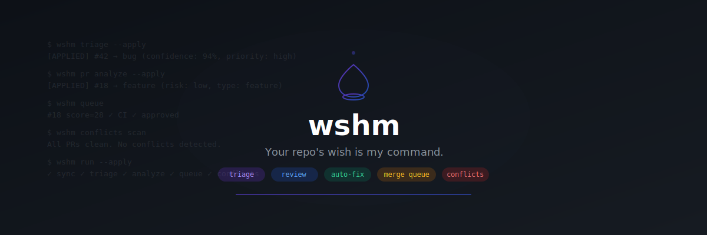

  

  <a href="../README.md">English</a> •
  <a href="README.fr.md">Français</a> •
  <a href="README.es.md">Español</a> •
  <a href="README.de.md">Deutsch</a> •
  <a href="README.ja.md">日本語</a> •
  <a href="README.zh.md">中文</a> •
  한국어 •
  <a href="README.pt.md">Português</a>

---

# wshm — GitHub 저장소 관리를 위한 AI 에이전트

**Your repo's wish is my command.**

wshm은 자율적인 저장소 유지보수 에이전트로 작동하는 CLI 도구 + GitHub Action입니다.

## 기능

- **이슈 자동 분류** — AI 기반 분류, 라벨링, 우선순위 설정
- **PR 분석** — 요약, 위험 평가, 리뷰 체크리스트
- **자동 수정** — 간단한 버그를 위한 Draft PR 자동 생성
- **머지 큐** — PR 스코어링 및 랭킹, 임계값 이상 자동 머지
- **충돌 해결** — 감지 및 자동 해결 (force-push 없음)
- **인라인 리뷰** — AI 기반 라인별 코드 리뷰
- **자동 할당** — 가중 랜덤으로 메인테이너 할당
- **라벨 블랙리스트** — 특정 라벨 적용 방지
- **주기적 재분류** — 오래된 분류 결과 정기 재평가
- **대시보드 및 리포트** — HTML 대시보드 및 Markdown/PDF 리포트

단일 바이너리. 당신의 API 키. 당신의 데이터. 인프라 불필요.

## 얼리 액세스

> **wshm은 현재 프라이빗 베타입니다.**
>
> **[contact@rtk-ai.app](mailto:contact@rtk-ai.app)** — 얼리 액세스 가능

---

  Rust로 구축. 인프라 불필요. 단일 바이너리. 
  &copy; 2026 <a href="https://rtk-ai.app">rtk-ai</a>

